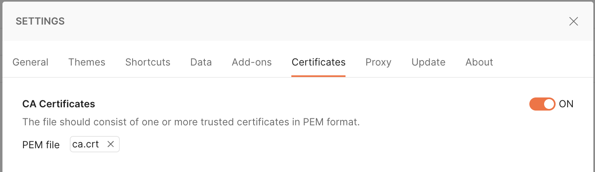
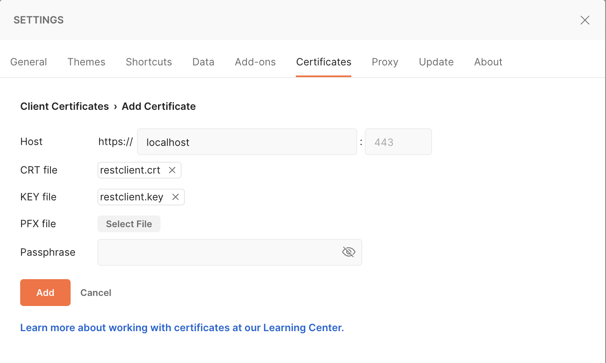
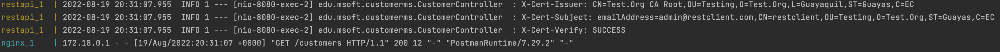

# Taller 20 - MTLS

## Guía

### 1. Instalar OpenSSL (Solo para Windows)

#### Alternativa 1

*Los siguientes pasos están basados en esta [guía](https://www.cloudinsidr.com/content/how-to-install-the-most-recent-version-of-openssl-on-windows-10-in-64-bit/)*

- Obtener instalador de esta [página](https://slproweb.com/products/Win32OpenSSL.html): `Win64 OpenSSL v3.1.2 Light`
- Ejecutar e instalar en un directorio fuera del directorio de Windows

#### Alternativa 2

Otra alternativa es ubicar el ejecutable que se instala junto con [Git for Windows](https://gitforwindows.org/): `C:\Program Files\Git\usr\bin\openssl.exe` y configurar su ubicación en la variable de entorno `PATH`.


### 2. Configurar un CA local

- En cualquier ruta de trabajo permanente, crear una carpeta llamada `openssl-ca`
  - Dentro, crear las carpetas: `certs`, `crl`, `newcerts` y `private` 
- Copiar todo el contenido de la carpeta `ca` hacia la carpeta recién creada `openssl-ca`
- Editar el archivo `openssl-ca/ca.cfg`
  - Dentro de la sección `[ my_ca ]`, el valor de la propiedad `dir` con la ruta completa hacia la carpeta creada anteriormente
    - Ejemplo en Windows: `D:\\work\\openssl-ca`
    - Ejemplo en Linux: `/home/<user>/work/openssl-ca`
    - Ejemplo en MacOS: `/Users/<user>/work/openssl-ca`
  - Dentro de la sección `[ my_req_distinguished_name ]` cambiar a conveniencia los valores de localidad
    - `countryName_default`
    - `stateOrProvinceName_default`
    - `localityName_default`
    - `organizationName_default`
      - Aquí, poner el nombre del grupo, por ejemplo: `MSOFT-Grupo-1`
    - `organizationalUnitName_default`
- En una consola nueva, ubicada en el directorio `openssl-ca`, ejecutar los siguientes comandos:
  - Crear una semilla random: `openssl rand -out private/.rand 1000`
  - Generar una llave privada RSA para el certificado root: `openssl genrsa -aes256 -out private/ca.key`
    - Se solicitará configurar una clave para la llave privada. Ingresar y recordar este valor para cuando sea solicitado. 
  - Generar el certificado root: `openssl req -config ca.cfg -new -x509 -key private/ca.key -days 3650 -out ca.crt`

### 3. Crear certificados hijos

#### Crear certificado servidor
- Editar el archivo `openssl-ca/req-restapi/restapi.cfg`
  - Dentro de la sección `[ dn ]` cambiar a conveniencia el valor de `emailAddress` de acuerdo al grupo:
    - Ejemplo: `grupo1-restapi@restapi.com`
- En una consola, ubicada en el directorio `openssl-ca/req-restapi`, ejecutar los siguientes comandos:
  - Generar llave privada RSA y solicitud de certificado: `openssl req -config restapi.cfg -newkey rsa -nodes -keyout restapi.key -out restapi.csr`
  - Generar certificado firmado por CA: `openssl ca -config ../ca.cfg -in restapi.csr -out restapi.crt`
- Completar la cadena de certificación en `restapi.crt`
  - Abrir el archivo `openssl-ca/ca.crt` en un editor de texto y copiar el contenido.
  - Abrir el archivo `openssl-ca/req-restapi/restapi.crt` en un editor de texto y pegar el texto copiado al final del mismo.
  - Guardar el archivo.

#### Crear certificado cliente
- Editar el archivo `openssl-ca/req-restclient/restclient.cfg`
    - Dentro de la sección `[ dn ]` cambiar a conveniencia el valor de `emailAddress` de acuerdo al grupo:
        - Ejemplo: `grupo1-restclient@restapi.com`
- En una consola, ubicada en el directorio `openssl-ca/req-restclient`, ejecutar los siguientes comandos:
    - Generar llave privada RSA y solicitud de certificado: `openssl req -config restclient.cfg -newkey rsa -nodes -keyout restclient.key -out restclient.csr`
    - Generar certificado firmado por CA: `openssl ca -config ../ca.cfg -in restclient.csr -out restclient.crt`
- Completar la cadena de certificación en `restclient.crt`
    - Abrir el archivo `openssl-ca/ca.crt` en un editor de texto y copiar el contenido.
    - Abrir el archivo `openssl-ca/req-restapi/restclient.crt` en un editor de texto y pegar el texto copiado al final del mismo.
    - Guardar el archivo.

### 4. Preparar la imagen de nginx
- Copiar los 3 archivos `openssl-ca/req-restapi/restapi.crt`, `openssl-ca/req-restapi/restapi.key` y `openssl-ca/req-restapi/restclient.crt` a la carpeta del repositorio `nginx/ssl`. Reemplazando los actuales.

### 5. Levantar el ambiente
- Empaquetar el proyecto `customer-ms`
  - Desde la carpeta del repositorio `customer-ms`, ejecutar:
    - En Windows: `mvnw.cmd clean package` 
    - En Linux o MacOS: `./mvnw clean package`
- Desde la carpeta raíz del repositorio
  - Ejecutar `docker-compose up --build`
    - Si `docker-compose` no está instalado, se puede seguir esta [guía](https://docs.docker.com/compose/install/).

### 6. Probar con curl

- Request inseguro (sin enviar certificado cliente)
  - Ejecutar: `curl -k https://localhost/customers`
  - Revisar respuesta: *No required SSL certificate was sent*.
- Request seguro (con certificado cliente)
  - Ejecutar, modificando las rutas del la clave privada (`key`) y del certificado cliente (`cert`) en el comando:
    ```
    curl -k \
    --key ~/devel/data/openssl-ca/req-restclient/restclient.key \
    --cert ~/devel/data/openssl-ca/req-restclient/restclient.crt \
    https://localhost/customers
    ```
- También se pueden ejecutar los comandos con el parámetro `-v` para poder ver el detalle dell *handshake* TLS en cada caso.

#### 6.1. Probar con Postman

- Configurar el certificado root de CA en Postman
  - Desde preferencias, entrar a la pestaña `Certificates`
  - En la sección `CA Certificates` ubicar y seleccionar el archivo `openssl-ca/ca.crt`
  
- Ejecutar con un nuevo request un `GET` a la URL `https://localhost/customers`
  - Revisar respuesta: *No required SSL certificate was sent*.
- Configurar el certificado cliente en Postman
  - Desde preferencias, entrar a la pestaña `Certificates`
  - En la sección `Client Certificates` seleccionar `Add certificate`
  - En `Host` ingresar `localhost`
  - En `CRT file` ubicar y seleccionar el archivo `openssl-ca/req-restclient/restclient.crt`
  - En `KEY file` ubicar y seleccionar el archivo `openssl-ca/req-restclient/restclient.crt`
  - Seleccionar `Add`
  
- Ejecutar con el mismo request un `GET` a la URL `https://localhost/customers`
  - Revisar respuesta sin error.

### 7. Probar con cliente Spring

- Crear keystore del cliente en formato P12
  - Abrir una consola, ubicarse en el directorio `openssl-ca/req-restclient` 
  - Ejecutar: `openssl pkcs12 -export -inkey restclient.key -in restclient.crt -out restclient-keystore.p12`
    - Va a pedir ingresar un `export password`, ingresar el valor `openssl`.
  - Copiar el archivo `restclient-keystore.p12` en el directorio `client-mtls/src/main/resources`, reemplazando de ser necesario.
- Create truststore en formato JKS (CA.crt)
  - Abrir una consola, ubicarse en el directorio `openssl-ca` 
  - Ejecutar: `keytool -import -v -trustcacerts -alias root -keypass openssl -file ca.crt -keystore truststore.jks -storepass openssl -storetype JKS`
    - Va a pedir ingresar una confirmación. Se ingresa `yes` y se da `Enter`
  - Copiar el archivo `truststore.jks` en el directorio `client-mtls/src/main/resources`, reemplazando de ser necesario.
- Ejecutar la clase `ClientMtlsApplication`

### 8. Comprobación

Finalmente, se podrá revisar a nivel cabeceras en el log de consola que se está utilizando el certificado cliente correspondiente.


## Aspectos a tratar
- Infraestructura de clave pública
  - CA y certificados cliente y servidor
- En componente `nginx`
  - Archivos de certificados
  - Dockerfile
- En proyecto `customer-ms`
  - Headers nuevos
  - Dockerfile
- Docker compose
- En proyecto `client-mtls`
  - Archivos `keystore.p12` y `truststore.jks`
  - Clases `CustomerClientConfiguration` y `CustomerPrinterRunner`
