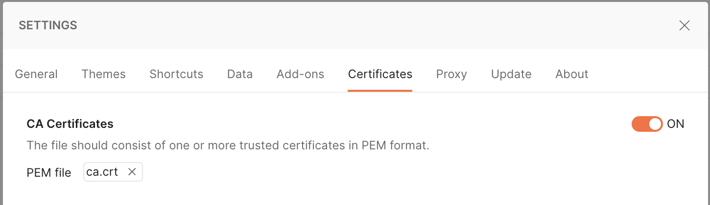
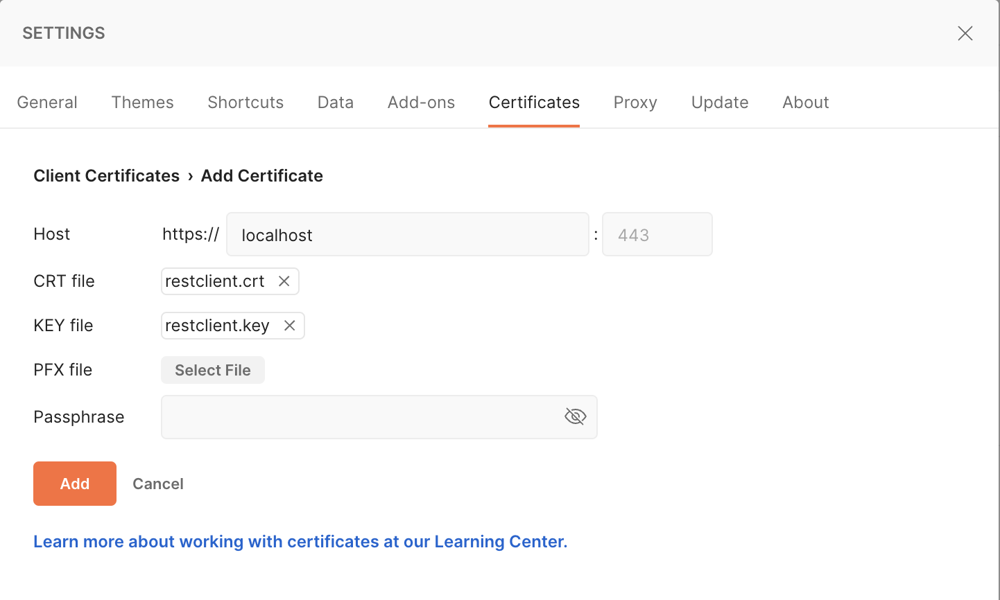
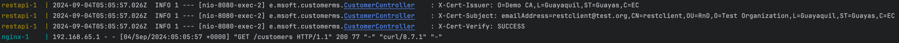

# Taller 20 - MTLS

## Guía

### 1. Instalar OpenSSL (Solo para Windows)

#### Alternativa 1

*Los siguientes pasos están basados en
esta [guía](https://www.cloudinsidr.com/content/how-to-install-the-most-recent-version-of-openssl-on-windows-10-in-64-bit/)*

- Obtener instalador de esta [página](https://slproweb.com/products/Win32OpenSSL.html): `Win64 OpenSSL v3.3.1 Light`
- Ejecutar e instalar en un directorio fuera del directorio de Windows

#### Alternativa 2

Otra alternativa es ubicar el ejecutable que se instala junto con [Git for Windows](https://gitforwindows.org/):
`C:\Program Files\Git\usr\bin\openssl.exe` y configurar su ubicación en la variable de entorno `PATH`.

### 2. Configurar un CA local

- Copiar la carpeta llamada [./openssl-ca](./openssl-ca) (y todo su contenido) dentro de cualquier ruta de trabajo
  local. Quedando por
  ejemplo: `D:\\work\\openssl-ca`. De aquí en adelante trabajaremos sobre ese directorio nuevo.
- Editar el archivo `./openssl-ca/demoCA.cfg`
    - Dentro de la sección `[ CA_default_DN ]` cambiar a conveniencia los valores de localidad
        - `countryName_default`
        - `stateOrProvinceName_default`
        - `localityName_default`
        - `0.organizationName_default`
            - Aquí, poner una referencia al nombre del grupo, por ejemplo: `MSOFT-Grupo-1 CA`
- En una consola nueva, ubicada en el directorio `./openssl-ca`, ejecutar los siguientes comandos:
    - Crear una semilla random: `openssl rand -out ./demoCA/private/.rand 1000`
    - Generar una llave privada RSA para el certificado root: `openssl genrsa -aes256 -out ./demoCA/private/ca.key`
        - Se solicitará configurar una clave para la llave privada. Ingresar y recordar este valor para cuando sea
          solicitado.
    - Generar el certificado root:
      `openssl req -config demoCA.cfg -new -x509 -key ./demoCA/private/ca.key -days 3650 -out ./demoCA/ca.crt`

### 3. Crear certificados hijos

#### Crear un certificado para el servidor (restapi)

- Editar el archivo `./openssl-ca/restapi/restapi.cfg`
    - Dentro de la sección `[ dn ]` cambiar a conveniencia el valor de `emailAddress` de acuerdo al grupo:
        - Ejemplo: `grupo1-restapi@test.org`
- En una consola, ubicada en el directorio `./openssl-ca`, ejecutar los siguientes comandos:
    - Generar llave privada RSA y solicitud de certificado:
      `openssl req -config restapi/restapi.cfg -newkey rsa -nodes -keyout restapi/restapi.key -out restapi/restapi.csr`
    - Generar certificado firmado por CA:
      `openssl ca -config demoCA.cfg -in restapi/restapi.csr -out restapi/restapi.crt`

#### Crear un certificado para el cliente (restclient)

- Editar el archivo `openssl-ca/restclient/restclient.cfg`
    - Dentro de la sección `[ dn ]` cambiar a conveniencia el valor de `emailAddress` de acuerdo al grupo:
        - Ejemplo: `grupo1-restclient@test.org`
- En una consola, ubicada en el directorio `./openssl-ca`, ejecutar los siguientes comandos:
    - Generar llave privada RSA y solicitud de certificado:
      `openssl req -config restclient/restclient.cfg -newkey rsa -nodes -keyout restclient/restclient.key -out restclient/restclient.csr`
    - Generar certificado firmado por CA:
      `openssl ca -config demoCA.cfg -in restclient/restclient.csr -out restclient/restclient.crt`

### 4. Preparar la imagen de nginx

- Copiar los 3 archivos (`./openssl-ca/restapi/restapi.crt`, `./openssl-ca/restapi/restapi.key` y
  `./openssl-ca/demoCA/ca.crt`) a la carpeta del repositorio [./nginx/ssl](./nginx/ssl), reemplazando los existentes.

### 5. Levantar el ambiente

- Empaquetar el proyecto `customer-ms`
    - Desde la carpeta del repositorio [./customer-ms](./customer-ms), ejecutar:
        - En Windows: `mvnw.cmd clean package`
        - En Linux o MacOS: `./mvnw clean package`
- Desde la carpeta raíz del repositorio
    - Ejecutar `docker compose up --build`
        - Si `docker compose` no está instalado, se puede seguir [esta guía](https://docs.docker.com/compose/install/).

### 6. Probar con curl

- Request inseguro (sin enviar certificado cliente)
    - Ejecutar: `curl -k https://localhost/customers`
    - Revisar respuesta: *No required SSL certificate was sent*.
- Request seguro (con certificado cliente)
    - Ejecutar, modificando las rutas del certificado raíz del CA (`cacert`), del certificado cliente (`cert`) y de la
      llave privada (`key`) en el comando:
      ```
      curl -k \
      --cacert ~/devel/data/openssl-ca/demoCA/ca.crt \
      --cert ~/devel/data/openssl-ca/restclient/restclient.crt \
      --key ~/devel/data/openssl-ca/restclient/restclient.key \
      https://localhost/customers
      ```
- También se pueden ejecutar los comandos con el parámetro `-v` para poder ver el detalle del *handshake* TLS en cada
  caso.

#### 6.1. Probar con Postman

- Configurar el certificado root de CA en Postman
    - Desde preferencias, entrar a la pestaña `Certificates`
    - En la sección `CA Certificates` ubicar y seleccionar el archivo `./openssl-ca/demoCA/ca.crt`
       **Actualizar imagen**
- Ejecutar con un nuevo request un `GET` a la URL `https://localhost/customers`
    - Revisar respuesta: *No required SSL certificate was sent*.
- Configurar el certificado cliente en Postman
    - Desde preferencias, entrar a la pestaña `Certificates`
    - En la sección `Client Certificates` seleccionar `Add certificate`
    - En `Host` ingresar `localhost`
    - En `CRT file` ubicar y seleccionar el archivo `openssl-ca/restclient/restclient.crt`
    - En `KEY file` ubicar y seleccionar el archivo `openssl-ca/restclient/restclient.key`
    - Seleccionar `Add`
       **Actualizar imagen**
- Ejecutar con el mismo request un `GET` a la URL `https://localhost/customers`
    - Revisar respuesta sin error.

### 7. Probar con cliente Spring

- Crear keystore del cliente en formato P12
    - Abrir una consola, ubicarse en el directorio `./openssl-ca/restclient`
    - Ejecutar: `openssl pkcs12 -export -inkey restclient.key -in restclient.crt -out restclient.p12`
        - Va a pedir ingresar un `export password`, ingresar el valor `openssl`.
    - Copiar el archivo `restclient.p12` en el directorio `client-mtls/src/main/resources`, reemplazando de ser
      necesario.
- Create truststore en formato JKS
    - Abrir una consola, ubicarse en el directorio `./openssl-ca/demoCA`
    - Ejecutar:
      `keytool -import -v -trustcacerts -alias root -keypass openssl -file ca.crt -keystore truststore.jks -storepass openssl -storetype JKS`
        - Va a pedir ingresar una confirmación. Se ingresa `yes` y se da `Enter`
    - Copiar el archivo `truststore.jks` en el
      directorio [./client-mtls/src/main/resources](./client-mtls/src/main/resources), reemplazando de ser
      necesario.
- Ejecutar la clase `ClientMtlsApplication`

### 8. Comprobación

Finalmente, se podrá revisar a nivel cabeceras en el log de consola que se está utilizando el certificado cliente
correspondiente.


## Aspectos a tratar

- Infraestructura de clave pública
    - CA y certificados cliente y servidor
- En componente `nginx`
    - Archivos de certificados
    - Dockerfile
- En proyecto `customer-ms`
    - Headers nuevos
    - Dockerfile
- Docker compose
- En proyecto `client-mtls`
    - Archivos `keystore.p12` y `truststore.jks`
    - Clases `CustomerClientConfiguration` y `CustomerPrinterRunner`

## Documentos relacionados

- [Directiva `ssl_client_certificate`](https://nginx.org/en/docs/http/ngx_http_ssl_module.html#ssl_client_certificate)
- [Documentos oficiales de OpenSSL](https://docs.openssl.org/3.3/)
